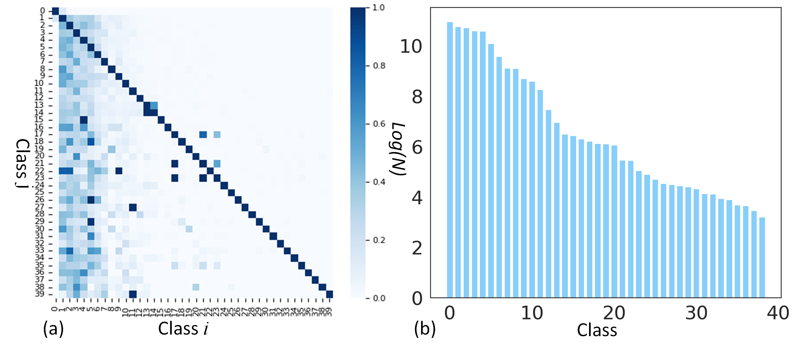
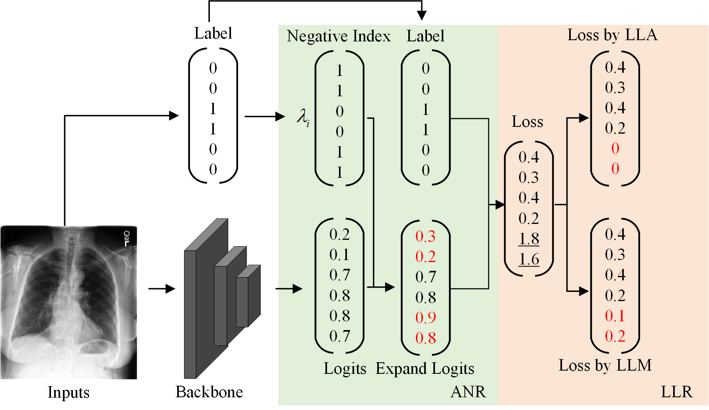

# LTML-MIMIC-CXR

[[Paper]]()

Long-tailed multi-label classification with noisy
label of thoracic diseases from chest X-ray.


## Requirements 
* [Pytorch](https://pytorch.org/)
* [Sklearn](https://scikit-learn.org/stable/)



Please download extra files for Google Drive 

```
## Quick start

### Use our dataset
The information of LTML-MIMIC-CXR is saved in `LTML_MIMIC_CXR_label_.csv`. The path of jpg images has been listed in `LTML_MIMIC_CXR_label_.csv`, which can be saved in `./data/mimicall/mimic`.

The `./appendix` contain the split of LTML-MIMIC-CXR in this repo.
```
appendix
  |--mimic
      |--class_freq.pkl
      |--class_split.pkl
      |--class_name.pkl
      |--img_id.pkl
      |--val.txt
      |--val.pkl
      |--test.txt
      |--test.pkl
```


### Training


#### Traing ANR_LLA

```
CUDA_VISIBLE_DEVICES=0 python tools/train.py --config ./configs/mimic/LTML_resnet50_ANR_LLA.py
```

#### Traing ANR_LLM
```
CUDA_VISIBLE_DEVICES=0 python tools/train.py --config ./configs/mimic/LTML_resnet50_ANR_LLM.py
```


### Testing

#### Test ANR_LLA
```
CUDA_VISIBLE_DEVICES=0 python tools/test.py --config './work_dirs/LTML_MIMIC_CXR_resnet50_ANR_LLA/LTML_resnet50_ANR_LLA.py'  --checkpoint './work_dirs/LTML_MIMIC_CXR_resnet50_ANR_LLA/latest.pth'
```

#### Test ANR_LLM
```
CUDA_VISIBLE_DEVICES=0 python tools/test.py --config './work_dirs/LTML_MIMIC_CXR_resnet50_ANR_LLA/LTML_resnet50_ANR_LLM.py'  --checkpoint './work_dirs/LTML_MIMIC_CXR_resnet50_ANR_LLM/latest.pth'
```

### Model 
The trained models is saved in `./work_dirs`, which can be used to inference directly.


